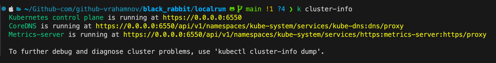
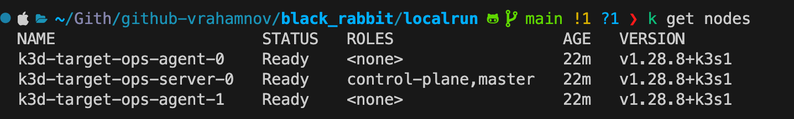
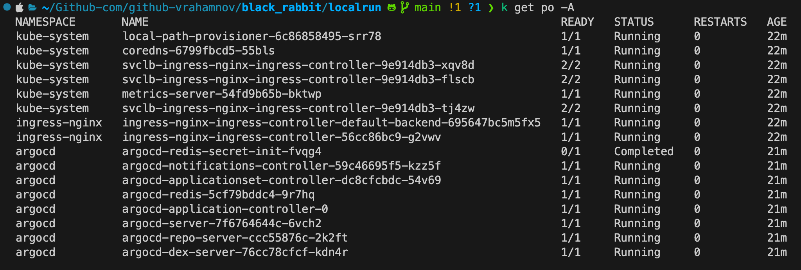
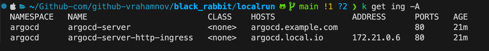
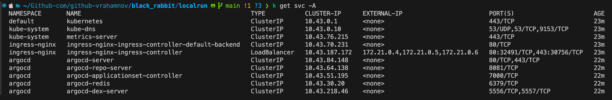
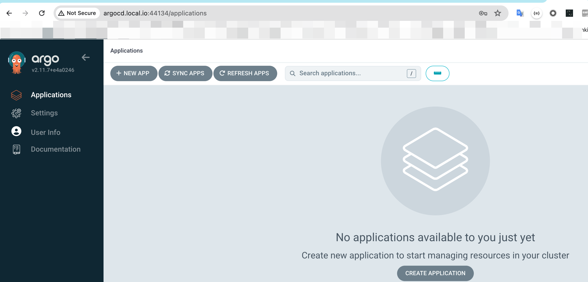
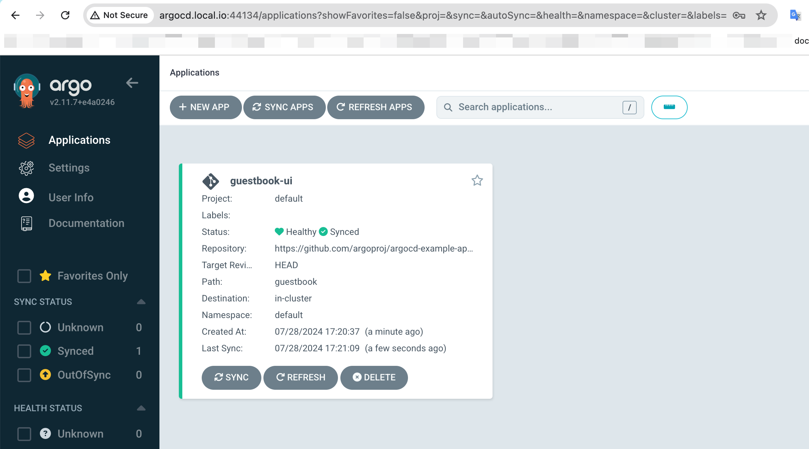

Hi, 

Welcome to our Git Repository for your DevOps skills assessment.

To begin:
1. Fork this repository.
2. Complete the tasks as outlined in the provided instructions.
3. Add your work and documentation to your forked repository.
4. Send us a link to your repository or zip and send us the files

Good luck!

# *Part 1: General Questions*
1. How would you implement devops for Mןicrosoft SQL Server Database - maintain history, releases, version control
```
   a. Use tools like Flyway, Liquibase.
   b. Create numbered, incremental scripts for schema changes.
   c. Include database changes in your pipeline alongside application code.
   d. OPTIONAL-Implement audit trails for data changes.
   e. As MS-SQL has an option of HA with listener , activate it to get an always-on endpoint for both RW-IO operations.
```
2. What is role of promote stage in ci-cd process.
```
   a. It moves code/artifacts that have passed testing in lower environments to higher environments (e.g., from staging to production).
   b. It often involves additional approval steps or quality gates before allowing the promotion.
   c. It can trigger environment-specific configurations or deployments for the target environment.
   d. IN SOME CASES PROMOTION CAN AND WILL intruduce the new version and deploy , with notification to service owner . 
```

3. Suppose there is an app which stores state in its memory - you want to enable working with multiple instance of this app at the same time with high availability - how will you achieve that?
```
   a. Implement distributed caching (e.g., Redis) or shared storage for state.
   b. Use sticky sessions or consistent hashing for routing requests to instances.
   c. Use a load balancer for traffic distribution and health monitoring.
```
4. How do you perform a Kubernetes upgrade with zero downtime?
```
   Depedant on CLOUD vendor feature , YET core is still the same: 
```
```
   BASE - run API obsolete scan - kubent\pluto\helm-mapkubeapis for deprecation scan !!

   a. Use a rolling update strategy:
   Upgrade one node at a time
   Ensure pods are distributed across multiple nodes
   b. Implement pod disruption budgets:
   Set minimum available replicas during the upgrade
   Use readiness and liveness probes:
   Ensure traffic only routes to healthy pods
   c. Employ blue-green or canary deployments:
   Test the upgrade on a subset of nodes first
   d. OPTIONAL Utilize cluster federation or multi-cluster setups:
   Route traffic between clusters during upgrades
   e. Upgrade control plane components first:
   Start with etcd, then API server, controller manager, and scheduler
   f. Upgrade worker nodes:
   Drain nodes before upgrading
   Cordon nodes to prevent new pod scheduling
   g. Test thoroughly:
   Verify application functionality after each step
```
# *Part 2: Kubernetes hands on*

1. **Cluster Setup:**
   - Provision a Kubernetes cluster using a tool like `kubeadm`, `kops`, or `kind`.
```
i used - k3d for it as personal preference .
```
2. **Nginx Deployment:**
   - Deploy nginx using helm this chart [nginx Helm](https://github.com/kubernetes/ingress-nginx/blob/main/charts/ingress-nginx).
   - When you will deploy the chart as DaemonSet, when not. What are the disatvantage/advantage of a DaemonSet. What will you choose if you need to use aws load balancer
   - How will you deploy the aws load balancer to work with eks
```
DaemonSet deployment:
Advantages:

Ensures an ingress controller pod on every node
Simplifies network routing - each node can handle ingress traffic
Can be more efficient for large clusters with high traffic

Disadvantages:

Uses more resources - runs on all nodes regardless of need
Less flexible scaling - tied to node count
May be overkill for smaller clusters or lower traffic scenarios

Deployment (non-DaemonSet):
Advantages:

More flexible scaling - can adjust replicas based on load
More resource-efficient for smaller clusters
Easier to manage and update

Disadvantages:

May require more complex network routing
Potential for uneven load distribution

For AWS Load Balancer:
If you're using an AWS Load Balancer, a Deployment is often preferred because:

AWS Load Balancer can route traffic to specific nodes/pods
You can control scaling more precisely
It's more cost-effective, as you're not running unnecessary ingress controller instances


However, the best choice depends on your specific requirements, cluster size, and traffic patterns

```


3.  **App Deployment:**
    - Deploy Jenkins (can be other app you choose) with helm [Jenkins Helm](https://github.com/jenkinsci/helm-charts/blob/main/charts/jenkins).

```
there are other apps of my choosings .[ argocd ,prometheus .... ]
```
          
3. **Scaling:**
   - Implement horizontal and vertical pod autoscaling for nginx using helm values (in the values file)
   ```
   look at localrun/argo_insecure.yml -L#7-EOF -> Uses core HPA\VPA -> not KEDA.
   ```
   - What is keda for auto scaling, why to use Keda?
   ```
   a. Uses actual workload to determine scale activities.
   b. Supports CPU\MEM\NETWORK and other attributes to determine scale policy . 
   c. KEDA allows for autoscaling of any container in Kubernetes based on the number of events needing to be   processed.
   d. Supports a wide range of event sources/scalers (e.g., Kafka, RabbitMQ, Azure Service Bus(TBD), Prometheus metrics)
   ```
     
4. **Networking:**
   - How would you restrict network between apps within the cluster? Write an example.
```
Well known example by official sigs .
```
   ```
   apiVersion: networking.k8s.io/v1
kind: NetworkPolicy
metadata:
  name: restrict-app-access
  namespace: myapps
spec:
  podSelector:
    matchLabels:
      app: frontend
  policyTypes:
  - Ingress
  - Egress
  ingress:
  - from:
    - podSelector:
        matchLabels:
          app: api
    ports:
    - protocol: TCP
      port: 80
  egress:
  - to:
    - podSelector:
        matchLabels:
          app: database
    ports:
    - protocol: TCP
      port: 5432
   ```

   - Expose the Jenkins applications using Ingress. 
```
EXAMPLE BASED ON APP RESULT : 

apiVersion: networking.k8s.io/v1
kind: Ingress
metadata:
  name: argocd-server-http-ingress
  namespace: argocd
  annotations:
    kubernetes.io/ingress.class: nginx
    nginx.ingress.kubernetes.io/backend-protocol: HTTP
    nginx.ingress.kubernetes.io/force-ssl-redirect: 'false'
    nginx.ingress.kubernetes.io/ssl-redirect: 'false'
spec:
  rules:
    - host: argocd.local.io
      http:
        paths:
          - path: /
            pathType: Prefix
            backend:
              service:
                name: argocd-server
                port:
                  number: 80

```

5. **Storage:**
   - Configure Persistent Volumes (PVs) and Persistent Volume Claims (PVCs) for Jenkins
```
i have used 50gb local PV to be claimed by K3D :
apiVersion: v1
kind: PersistentVolume
metadata:
  name: k3d-pv
  labels:
    type: local
  annotations:
    kubectl.kubernetes.io/last-applied-configuration: >
      {"apiVersion":"v1","kind":"PersistentVolume","metadata":{"annotations":{},"labels":{"type":"local"},"name":"k3d-pv"},"spec":{"accessModes":["ReadWriteOnce"],"capacity":{"storage":"50Gi"},"hostPath":{"path":"/k3dvol"},"storageClassName":"manual"}}
  finalizers:
    - kubernetes.io/pv-protection
spec:
  capacity:
    storage: 50Gi
  hostPath:
    path: /k3dvol
    type: ''
  accessModes:
    - ReadWriteOnce
  persistentVolumeReclaimPolicy: Retain
  storageClassName: manual
  volumeMode: Filesystem

```

```
Example BY helm on argo chart : 
server:
  ingress:
    enabled: true
  extraArgs:
    - --insecure

  volumes:
    - name: argocd-repo-server
      persistentVolumeClaim:
        claimName: argocd-repo-server-pvc

  volumeMounts:
    - name: argocd-repo-server
      mountPath: /app/config/repo-server

repoServer:
  volumes:
    - name: argocd-repo-server
      persistentVolumeClaim:
        claimName: argocd-repo-server-pvc

  volumeMounts:
    - name: argocd-repo-server
      mountPath: /app/config/repo-server

redis:
  enabled: true
  persistence:
    enabled: true
    storageClass: "standard"  # Adjust based on your cluster's available storage classes
    accessMode: ReadWriteOnce
    size: 8Gi

persistence:
  enabled: true
  storageClassName: "standard"  # Adjust based on your cluster's available storage classes

  argocdRepoServer:
    enabled: true
    accessMode: ReadWriteOnce
    size: 10Gi

  argocdBackups:
    enabled: true
    accessMode: ReadWriteOnce
    size: 5Gi
```

6. **Security:**
   - Implement an example Role-Based Access Control (RBAC) on one of the namespace for example restrict a user from some namespace,
```
Example: 

apiVersion: rbac.authorization.k8s.io/v1
kind: Role
metadata:
  namespace: restricted-namespace
  name: no-access-role
rules: []
---
apiVersion: rbac.authorization.k8s.io/v1
kind: RoleBinding
metadata:
  name: no-access-rolebinding
  namespace: restricted-namespace
subjects:
- kind: User
  name: <username>  # Replace with the actual username
  apiGroup: rbac.authorization.k8s.io
roleRef:
  kind: Role
  name: no-access-role
  apiGroup: rbac.authorization.k8s.io
---

TEST it out with : kubectl auth can-i get pods --namespace=restricted-namespace --as=<username>

```

   - What is the purpose of the of the service account - how can it be useful in scenarios over aws.

```
a. Service account is a pod to API interaction authentication mechanism.
b. By assigning different Service Accounts to different applications, you can isolate permissions and enhance security. Each application can be restricted to its own set of permissions, reducing the risk of privilege escalation.
c. In AWS SA can be applied from pod level against AWS IAM role Assumtion, allowing service get X amount of permissions from AWS while the SA is active and pointed properly to AWS IAM role .

Known Example by AWS : {
  "Version": "2012-10-17",
  "Statement": [
    {
      "Effect": "Allow",
      "Principal": {
        "Federated": "arn:aws:iam::<AWS_ACCOUNT_ID>:oidc-provider/<OIDC_PROVIDER>"
      },
      "Action": "sts:AssumeRoleWithWebIdentity",
      "Condition": {
        "StringEquals": {
          "<OIDC_PROVIDER>:sub": "system:serviceaccount:<NAMESPACE>:<SERVICE_ACCOUNT_NAME>"
        }
      }
    }
  ]
}

```

## HOW TO & PREREQUISITES :
```
make sure the following are installed : 
helm
mkcert
kubectl
k3d 
```

Based on precreated variables (use default \ modify when needed ): 
```
Update Complete. ⎈Happy Helming!⎈
Cluster Name [target-ops]: 
Cluster Domain [local.io]: 
API Port [6550]: 
Servers (Masters) [1]: 
Agents (Workers) [2]: 
LoadBalancer HTTP Port [44134]: 
LoadBalancer HTTPS Port [6600]: 
Registry Port [7979]: 
```
Steps to run :
```
chmod +x ./localrun/ysd-backpack.sh
./localrun/ysd-backpack.sh
```


## OUTPUT : 










### Local endpoint injected by helper script 


### On top of the allocated infra feel free to rollout argoproj example app - guestbook: 



```
kubectl -n argocd get secret argocd-initial-admin-secret -o jsonpath="{.data.password}" | base64 -d; echo

argocd login argocd.<LOCAL_SELECTED_CLUSTER_DOMAIN>:44134

argocd app create guestbook-ui \
--repo https://github.com/argoproj/argocd-example-apps.git \
--path guestbook \
--dest-server https://kubernetes.default.svc \
--dest-namespace default

argocd app sync guestbook-ui

argocd app get guestbook-ui
```